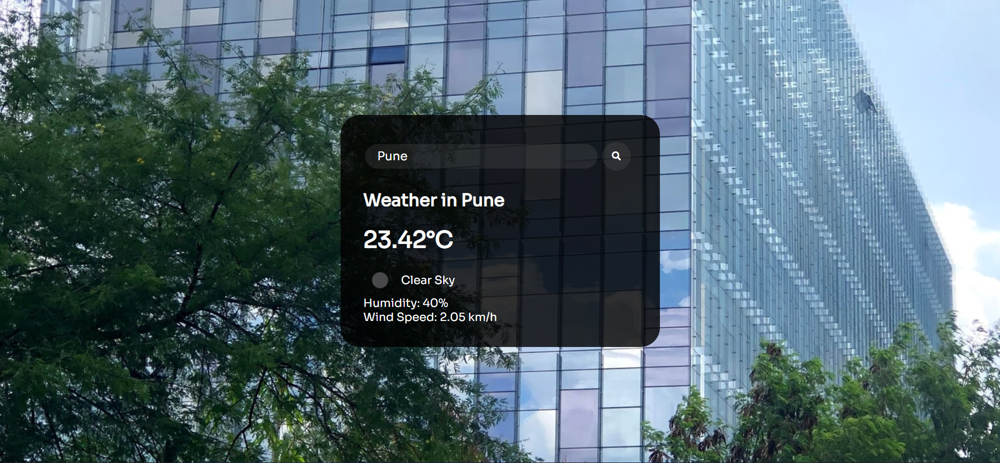

## Weather App

This is a simple JavaScript project to tell the weather of your current location or the city entered. This project used [**OpenWeatherMap API**](https://openweathermap.org/api) and [**OpenCageData API**](https://opencagedata.com/api) to fetch weather of your current location.

The site is deployed using Netlify, please check that out [**here :globe_with_meridians:**](https://weather-geo.netlify.app/)

